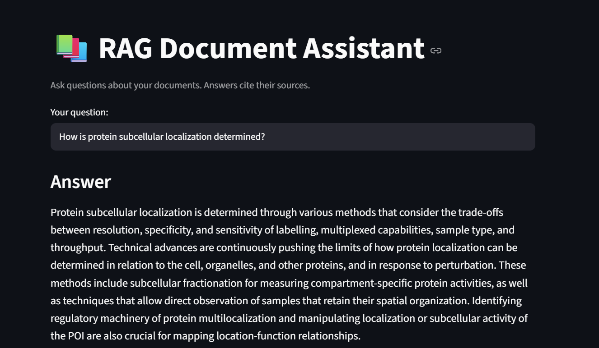
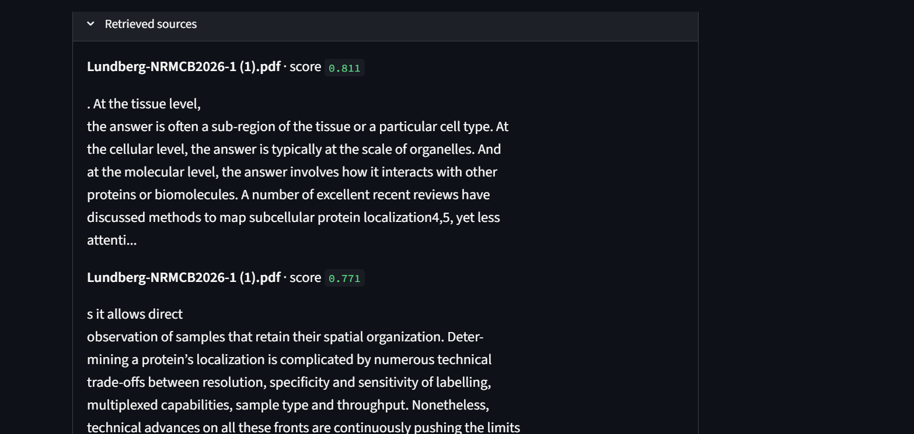
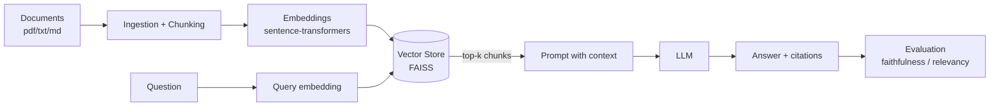

# RAG Document Assistant

[](https://github.com/NataliaBV1/rag-document-assistant/actions)
[](https://www.python.org/)
[](LICENSE)
[](https://github.com/astral-sh/ruff)

An end-to-end **Retrieval-Augmented Generation (RAG)** system that answers questions over a collection of documents, **with a quantitative evaluation layer** to measure answer quality. Built intentionally *framework-light* (no LangChain/LlamaIndex) to demonstrate understanding of the retrieval and generation internals.

> **Why this project:** most portfolio RAGs are toy demos with no measurement. This one treats quality as a measurable problem: it compares chunking strategies and reports retrieval metrics (Hit Rate, MRR) and generation metrics (faithfulness, answer relevancy) via LLM-as-judge.

---

## Results

> ⚠️ Fill in this table after your first run. Recruiters scan it first.

| Configuration          | Chunk size | Top-k | Hit Rate@k | MRR  | Faithfulness | Answer Relevancy |
|------------------------|-----------:|------:|-----------:|-----:|-------------:|-----------------:|
| Baseline (fixed chunk) |        512 |     3 |       0.00 | 0.00 |         0.00 |             0.00 |
| + overlap 128          |        512 |     3 |       0.00 | 0.00 |         0.00 |             0.00 |
| + top-k 5              |        512 |     5 |       0.00 | 0.00 |         0.00 |             0.00 |
**Demo:**





---

## The problem

Searching through dozens or hundreds of documents (papers, technical reports, docs) is slow and error-prone. A RAG system retrieves the most relevant passages and uses them as context so an LLM can generate an answer **grounded in the sources**, with citations, reducing hallucinations. This project indexes a document collection and answers natural-language questions, showing which passages each answer came from.

## Architecture



## Quickstart

```bash
# 1. Install dependencies (recommended: uv)
uv sync                 # or: pip install -e .

# 2. Configure your LLM API key
cp .env.example .env    # then edit .env with your key

# 3. Put documents in data/raw/ and build the index
python scripts/ingest.py --config configs/config.yaml

# 4. Ask a question from the CLI
python scripts/query.py --question "What is the main conclusion of paper X?"

# 5. Launch the web demo
streamlit run app.py

# 6. Evaluate quality over a set of questions
python scripts/evaluate.py --qa data/eval_qa.json
```

## Project structure

```
rag-document-assistant/
├── configs/config.yaml        # hyperparameters (chunk size, top-k, models)
├── data/raw/                  # your documents (gitignored)
├── src/rag_assistant/
│   ├── config.py              # configuration loading
│   ├── ingestion.py           # document loading + chunking
│   ├── embeddings.py          # embedding model wrapper
│   ├── vectorstore.py         # FAISS index (build/save/load/search)
│   ├── retrieval.py           # top-k retrieval
│   ├── generation.py          # prompt + LLM call
│   ├── pipeline.py            # orchestrates ingestion and querying
│   └── evaluation.py          # retrieval and generation metrics
├── scripts/                   # CLI entrypoints: ingest / query / evaluate
├── app.py                     # Streamlit demo
└── tests/                     # pytest
```

## Stack

- **Embeddings:** sentence-transformers (`all-MiniLM-L6-v2` by default)
- **Vector store:** FAISS (CPU)
- **LLM:** Anthropic/OpenAI API (configurable) or a local model
- **Interface:** Streamlit
- **Evaluation:** LLM-as-judge (faithfulness, answer relevancy) + retrieval metrics (Hit Rate, MRR). Production alternative: [RAGAS](https://github.com/explodinggradients/ragas).
- **Code quality:** ruff, pre-commit, pytest, GitHub Actions

> **Design note:** this project intentionally avoids LangChain/LlamaIndex to expose the mechanics of RAG. In production both are valid drop-in alternatives; the point here is to show I understand what each layer does.

## Data

Place your documents in `data/raw/` (pdf, txt, md). For the evaluation set, create `data/eval_qa.json` with question/expected-source pairs and, optionally, the ground-truth source chunk for retrieval metrics. See the format in `scripts/evaluate.py`.

## Evaluation

- **Retrieval:** Hit Rate@k and MRR (require ground-truth relevant chunk).
- **Generation:** faithfulness (is the answer supported by the context?) and answer relevancy (does it address the question?), measured with LLM-as-judge.

## Future work

- Reranking (cross-encoder) over the initial top-k
- Hybrid search (BM25 + dense)
- Semantic chunking vs. fixed-size
- Response streaming in the UI

## References

- Lewis et al. (2020), *Retrieval-Augmented Generation for Knowledge-Intensive NLP Tasks*
- RAGAS: metrics for RAG evaluation

## Author

**Natalia Becerra Villada** — Physics Engineer | ML / Deep Learning
[LinkedIn]((https://linkedin.com/in/natalia-becerra-villada) · [GitHub](https://github.com/NataliaBV1)
